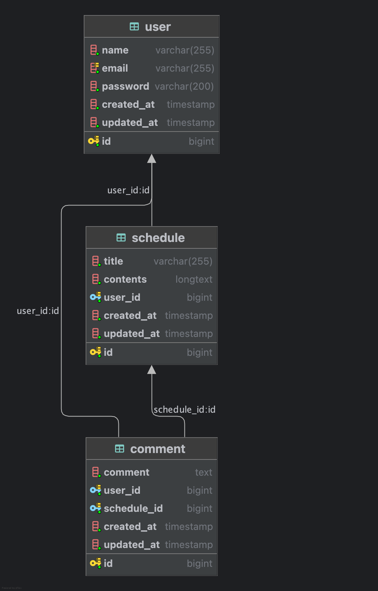

# 📆 Schedule API (Plus)
<div style="display: flex; gap: 5px;">


</div>

##  개요
- [📌 프로젝트 회고(velog)](https://velog.io/@wannabeing/%ED%9A%8C%EA%B3%A0-%EC%9D%BC%EC%A0%95-API-%ED%94%8C%EB%9F%AC%EC%8A%A4-%EA%B3%BC%EC%A0%9C-%ED%9A%8C%EA%B3%A0)
- 개발기간: 2025.03.27(목) ~ 2025.04.04(금)
- 자바버전: OpenJDK 17
- 사용기술: Spring Boot, JPA, MySQL
- RESTful한 일정 관리 백엔드 API 서버 (JPA를 곁들인)

---

## 기능 목록
### 👤 유저 기능
- **GET**
  - 유저 조회 (단일 조회)
  - 내 정보 조회 (로그인 시, 가능)
- **POST**
  - 회원가입 (이메일, 이름, 비밀번호)
  - 로그인 (이메일, 비밀번호)
  - 로그아웃
- **PATCH**
  - 유저 정보 수정: 이메일, 이름 (이메일은 중복불가)
- **DELETE**
  - 삭제 

### 🗓️ 일정(Schedule) 기능
- **GET**
  - 모든 일정 조회 (페이징 구현)
  - 단일 일정 조회
- **POST**
  - 일정 생성: 제목, 내용
- **PATCH**
    - 일정 수정: 제목, 내용
- **DELETE**
    - 일정 삭제

### 🗓️ 댓글(Comment) 기능
- **GET**
    - 단일 일정의 모든 댓글 조회 (페이징 구현)
    - 단일 일정의 단일 댓글 조회
- **POST**
    - 댓글 생성: 내용
- **PATCH**
    - 댓글 수정: 내용
- **DELETE**
    - 댓글 삭제
### 🚀 추가 기능
- 로그인 기능
  - `session`을 통해 구현 
- 예외처리 핸들러 (@RestControllerAdvice)
  - `exception` 패키지에 구성
- 비밀번호 암호화 (BCrypt)
  - `SpringSecurity` 설정을 통해 구현
- 유효성 검증 (@Valid)

---

## API 명세서
### 🎃 [[Postman] Schedule API (PLUS) 문서 보기](https://documenter.getpostman.com/view/40705962/2sB2cU9hGT)


> ### 예시) Schedule 단건 조회
>#### Request (GET)
>- URL
   >    - {BASE_URL}/schedule/{scheduleId}
>    - ex. http://localhost:8080/schedule/1
>- 파라미터
   >    - **[필수]** (Long) scheduleId: 일정 id
>    
>#### Response (JSON)
>```json
>{
>   "timestamp": "2025-04-04 15:56:27",
>   "code": 200,
>   "status": "OK",
>   "path": "/schedule/1",
>   "message": "단일 일정을 조회합니다",
>   "data": {
>       "scheduleId": 1,
>       "title": "test",
>       "contents": "123123123",
>       "createdAt": "2025-04-03 10:47:30",
>       "updatedAt": "2025-04-03 10:47:30",
>       "user": {
>           "id": 1,
>           "name": "test",
>           "email": "123@123.com"
>       }
>   }
>}
>```

---

## ERD
### 유저(User)와 일정(Schedule)은 1:N 관계
- 유저 1명은 여러 일정을 가질 수 있다.
- 각 일정은 반드시 유저에 속해야 한다.
### 유저(User)와 댓글(Comment)은 1:N 관계
- 유저 1명은 여러 댓글을 가질 수 있다.
- 각 댓글은 반드시 유저에 속해야 한다.
### 일정(Schedule)과 댓글(Comment)는 1:N 관계
- 일정 1개는 여러 댓글을 가질 수 있다.
- 각 댓글은 반드시 일정에 속해야 한다.



---

```
src
└── main
    └── java
        └── org.example.spartascheduleplus
            ├── SpartaSchedulePlusApplication.java       # ✅ Main()
            │
            ├── config                                   # 환경설정
            │   └── SecurityConfig.java                  # 스프링시큐리티 설정
            │
            ├── controller                               # 🚀 Controller
            │   ├── comment
            │   │   └── CommentController.java           # 댓글 API 컨트롤러
            │   ├── schedule
            │   │   └── ScheduleController.java          # 일정 API 컨트롤러
            │   └── user
            │       ├── SignUpController.java            # 회원가입 API 컨트롤러
            │       └── UserController.java              # 유저 API 컨트롤러
            │
            ├── dto                                      # 🚀 DTO
            │   ├── api                                  # API 응답 DTO   
            │   │   ├── ErrorResponseDto.java
            │   │   └── SuccessResponseDto.java
            │   │
            │   ├── comment                              # 댓글 DTO
            │   │   ├── CommentDetailResponseDto.java    
            │   │   ├── CommentRequestDto.java           
            │   │   ├── CommentResponseDto.java          
            │   │   └── PagedCommentResponseDto.java     
            │   │
            │   ├── common
            │   │   └── PageInfo.java                    # 페이징  DTO
            │   │
            │   ├── schedule                             # 일정 DTO
            │   │   ├── ScheduleDetailResponseDto.java   
            │   │   ├── ScheduleInfoDto.java             
            │   │   ├── ScheduleRequestDto.java          
            │   │   ├── ScheduleResponseDto.java         
            │   │   └── PagedScheduleResponseDto.java    
            │   │
            │   └── user                                 # 유저 DTO
            │       ├── LoginRequestDto.java             
            │       ├── SignUpRequestDto.java            
            │       ├── UserInfoDto.java                 
            │       ├── UserPasswordRequestDto.java      
            │       ├── UserRequestDto.java              
            │       └── UserResponseDto.java             
            │
            ├── entity                                   # 🚀 Entity
            │   ├── comment
            │   │   └── Comment.java                     # 댓글 엔티티
            │   ├── schedule
            │   │   └── Schedule.java                    # 일정 엔티티
            │   ├── user
            │   │   └── User.java                        # 유저 엔티티
            │   └── BaseEntity.java                      # 베이스 엔티티
            │
            ├── exception                                # 🚀 Exception
            │   ├── ApiExceptionHandler.java             # 전역 예외 처리 핸들러
            │   └── ResponseExceptionProvider.java       # 예외처리 예외 유틸
            │
            ├── filter                                   # 필터
            │   └── LoginFilter.java                     # 로그인 필터
            │
            ├── repository                               # 🚀 Repository
            │   ├── comment
            │   │   └── CommentRepository.java           # 댓글 JPA Repository
            │   ├── schedule
            │   │   └── ScheduleRepository.java          # 일정 JPA Repository
            │   └── user
            │       └── UserRepository.java              # 유저 JPA Repository
            │
            └── service                                  # 🚀 Service
                ├── comment
                │   └── CommentService.java              # 댓글 Service
                ├── schedule
                │   └── ScheduleService.java             # 일정 Service
                └── user
                    └── UserService.java                 # 유저 Service

```